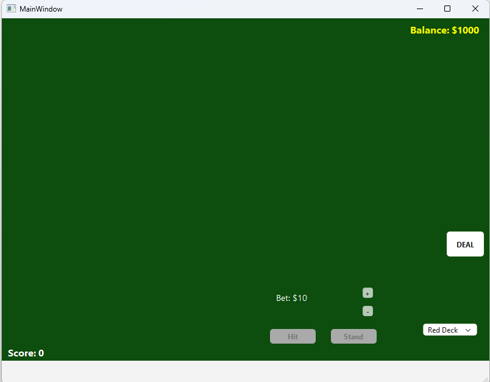
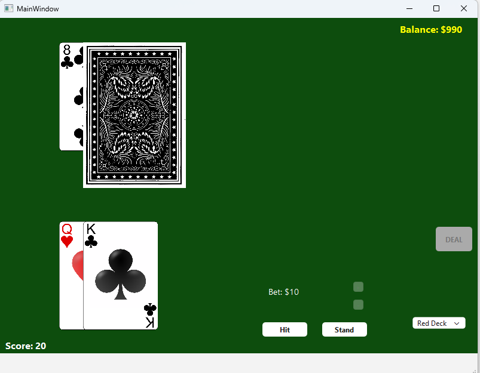
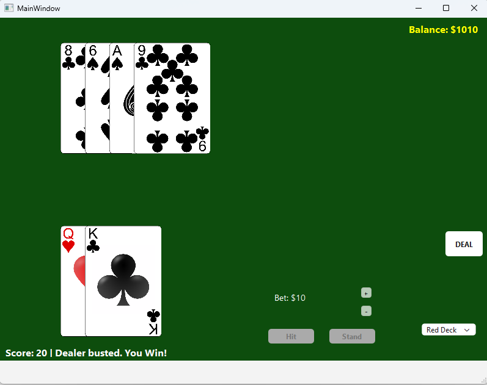

# 🃏 Blackjack (Qt 6 C++)

A classic Blackjack game implemented in C++ using the Qt 6 framework. The project features a custom graphical interface using `QGraphicsScene`, smooth animations, a betting system, and dynamic skin selection.

## ✨ Features
* **Core Gameplay:** Standard Blackjack rules (Hit, Stand, Dealer AI logic).
* **Betting System:** Manage your bankroll, place bets, and earn winnings (1:1 payout, Blackjack logic).
* **Animations:** Smooth card dealing animations using `QPropertyAnimation`.
* **Visual Customization:** Switch between **Red** and **Blue** card decks in runtime.
* **Modern UI:** Styled buttons and a classic green casino table background.
* **Architecture:** Logic and UI separation using smart pointers and RAII principles.

## 🛠 Tech Stack
* **Language:** C++17
* **Framework:** Qt 6 (Widgets, Graphics View Framework)
* **Build System:** CMake
* **Assets:** Dynamic loading of PNG resources

## 🚀 How to Build & Run
1.  Open the project in **Qt Creator** (open `CMakeLists.txt`).
2.  Configure the project.
3.  Build the project.
4.  **Important:** Ensure the `assets` folder is located in the build directory next to the executable file.
5.  Run.

## 📸 Screenshots

### Main Menu

### Gameplay

